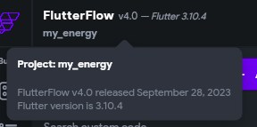

# Simtricity MyEnergy App

This repo holds the code for the MyEnergy app and the scripts to build it.

See the repositories [simt-myenergy-gh-pages-qa](https://github.com/cepro/simt-myenergy-gh-pages-qa) and [simt-myenergy-gh-pages-prod](https://github.com/cepro/simt-myenergy-gh-pages-prod). Build code is pushed to there and deployed to github pages which is where the app gets hosted.

## Install Tools

Install:
- [Flutterflow cli](https://github.com/FlutterFlow/flutterflow-cli)
- [fvm](https://fvm.app/docs/getting_started/installation)

## Setup

Setup 2 folders, the first with this code and tools, the second points to the github pages repo where the built code will be pushed too:  
```sh
# Clone this repository
project> git clone git@github.com:cepro/simt-myenergy-all.git

# Then setup a repository that points to the github pages repositories using a remote for each:
project> mkdir simt-myenergy-gh-pages && cd simt-myenergy-gh-pages 
simt-myenergy-gh-pages> git init
simt-myenergy-gh-pages(main)> git remote add qa git@github.com:cepro/simt-myenergy-gh-pages-qa.git
simt-myenergy-gh-pages(main)> git remote add prod git@github.com:cepro/simt-myenergy-gh-pages-prod.git
simt-myenergy-gh-pages(main)> git fetch qa
simt-myenergy-gh-pages(main)> git fetch prod
simt-myenergy-gh-pages(main)> git checkout -b main-prod prod/main
simt-myenergy-gh-pages(main-prod)> git checkout -b main-qa qa/main
simt-myenergy-gh-pages(main-qa)>
```

## Flutter Version

The version used by the project is in [.flutter-version](./.flutter-version).

We use the same flutter version that Flutterflow uses which can be seen in the top left corner of the FlutterFlow UI:



Manually update .flutter-version when Flutterflow upgrades this Flutter version.

## Folders

flutterflow-export/
- export app code from flutterflow
- track copies of the original flutterflow code without any modifications

local-stage/
- local build (see [bin/build-local](bin/build-local))
- local dev runs from this copy (see [bin/run-local](bin/run-local))

patches/
- patches to be applied to the flutterflow export code

## Run Locally

```sh
bin/flutterflow-export
bin/build-local
bin/run-local
```

## Build for github pages deployment
Run the following to build the app: copy to the .
```sh
bin/build-github-pages
```

The script will:
 - export code from flutterflow
 - apply our patches
 - build it
 - copy files to the simt-myenergy-gh-pages/ folder created in the setup step above

Then from this repository:
 - manually check the changes look okay
 - git commit
 - push changes

A Github Action will then rebuild and deploy the site.
