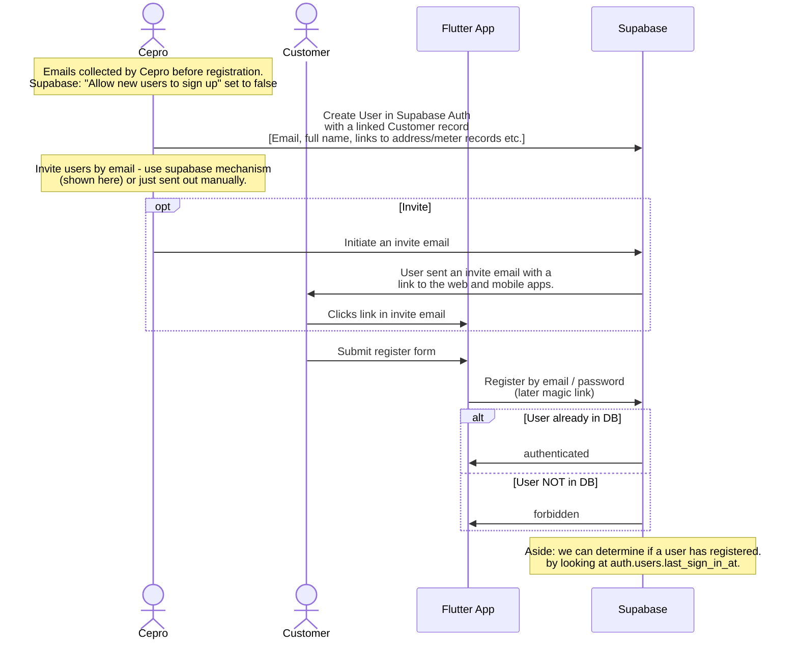

# MyEnergy Auth - Registration

```mermaid
sequenceDiagram
    actor Cepro
    actor Customer
    
    participant App as Flutter App
    participant Supabase
    
    note over Cepro: Emails collected by Cepro before registration.<br/>Supabase: "Allow new users to sign up" set to false
    Cepro->>Supabase: Create User in Supabase Auth<br/>with a linked Customer record<br/>[Email, full name, links to address/meter records etc.]

    note over Cepro: Invite users by email - use supabase mechanism<br/>(shown here) or just sent out manually.
    opt Invite
        Cepro->>Supabase: Initiate an invite email
        Supabase->>Customer: User sent an invite email with a<br/>link to the web and mobile apps.
        Customer->>App: Clicks link in invite email
    end

    Customer->>App: Submit register form
    App->>Supabase: Register by email / password<br/>(later magic link)
    alt User already in DB
    Supabase->>App: authenticated
    else User NOT in DB
    Supabase->>App: forbidden
    end

    note over Supabase: Aside: we can determine if a user has registered.<br/>by looking at auth.users.last_sign_in_at.
```