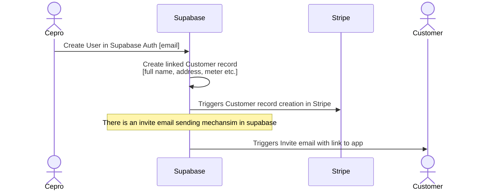

# MyEnergy - New User Onboard and Invite

This flow describes onboarding of new user. These steps must occur before a user is invited to register with the app.

Email and other details about the customer including home and meter are collected manually and added to the database.

