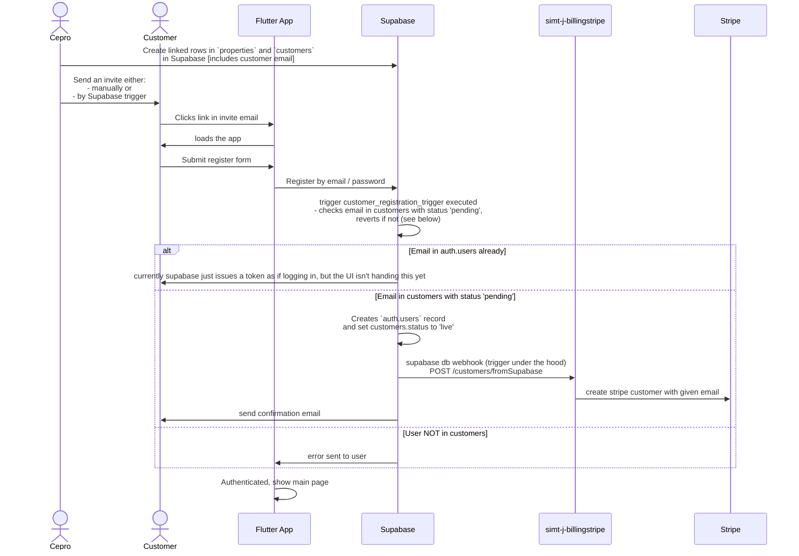

# MyEnergy - New User Onboard

This flow describes onboarding of new user.

Email and other details about the customer including home and meter are collected manually and added to the database.

Then the user can regsister with a password of their choosing.

