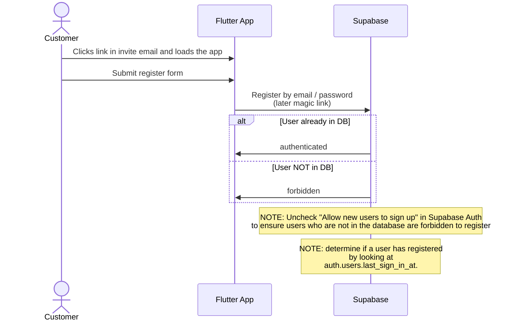

# MyEnergy - User Registration

This flow occurs after the [onboard flow](./onboard-flow.md). 

```mermaid
sequenceDiagram
    actor Customer
    participant App as Flutter App
    participant Supabase
    
    Customer->>App: Clicks link in invite email and loads the app
    Customer->>App: Submit register form
    App->>Supabase: Register by email / password<br/>(later magic link)
    alt User already in DB
    Supabase->>App: authenticated
    else User NOT in DB
    Supabase->>App: forbidden
    end

    note over Supabase: NOTE: Uncheck "Allow new users to sign up" in Supabase Auth<br/>to ensure users who are not in the database are forbidden to register
    note over Supabase: NOTE: determine if a user has registered<br/>by looking at<br/> auth.users.last_sign_in_at.
```