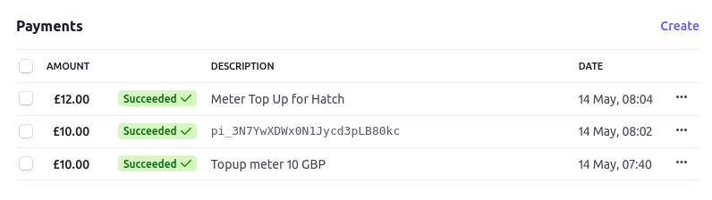

# Script and basic web form for Stripe Link POC 

Cloned and simplified for our need from https://github.com/stripe-samples/link.

This repo demonstrates how to take authorization from a customer to make future payments and how to make those payments.

With this setup I was able to:
- create a customer
- obtain authorization for future payments
- make 3 payments without any user interaction
- test with and without 3d secure cards

Untested:
- error conditions - insufficient funds, card authorization failed, etc.

## Steps

Followed the steps on https://stripe.com/docs/payments/link/save-and-reuse.

Actual steps I took:
- setup stripe developer test api keys
- created a customer using the curl example (step 2 in stripe docs)
- created a setup intent also with curl (step 3 in stripe docs)
- created the app in client/ and server/ in this repo which configures and shows the payment form to the user
    - see below for how to configure and start it
    - NOTE: setup intent client secret embedded in client/index.js (update it there for new setups), same for the passthrough user email
- ran the app and filled in the payment details on the form
- get the paument_method id created from the previous step by querying https://api.stripe.com/v1/payment_methods 
- use server/submit-payment-intent.js
    - insert the payment_method id from the previous step and customer_id
    - tweak amount and description as desired
    - run script multiple times to make multiple payments
    - check customer under the stripe dashboard to see the payments:

[]

## HTML Page and Backend demoing how to capture authorization

1. Confirm `.env` configuration

Ensure the API keys are configured in `.env` in this directory. It should include the following keys:

```yaml
# Stripe API keys - see https://stripe.com/docs/development/quickstart#api-keys
STRIPE_PUBLISHABLE_KEY=pk_test...
STRIPE_SECRET_KEY=sk_test...

# Path to front-end implementation
STATIC_DIR=../client/html
```

2. Install dependencies

```
yarn
```

3. Run the application

```
yarn start
```

4. Go to `localhost:4242`

Shows a form that a customer can fill in to authorize us to make future payments.

See [here](https://stripe.com/docs/payments/accept-a-payment?platform=web#additional-testing-resources) for test credit card details that work on this form.

